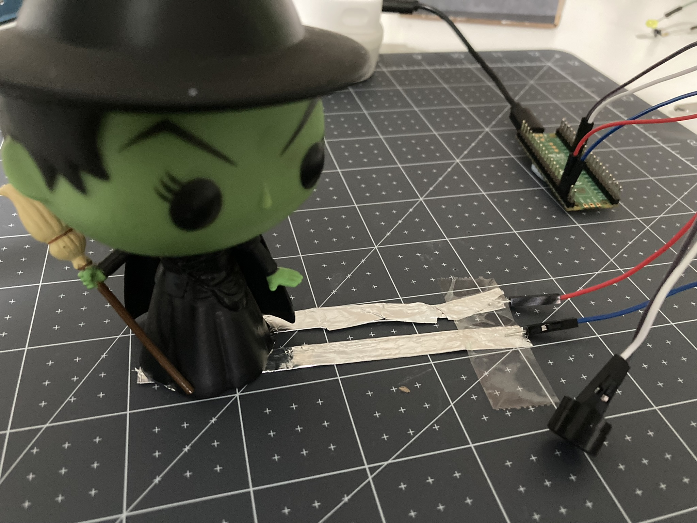

## Ce que tu vas faire

Créer une machine à sons qui jouera des effets sonores ou de la musique à l'aide de boutons, d'interrupteurs ou d'un potentiomètre.

**Les sons** peuvent être utiles, apaisants, ennuyeux et énergisants. Un nouveau-né peut trouver une machine à bruit blanc apaisante et le son peut l'aider à dormir. Les DJ utilisent des machines à sons portables pour composer des rythmes lors de leurs déplacements. Les farceurs utilisent des machines à effets sonores pour faire rire les gens. Peux-tu penser à une machine à sons que tu as utilisée dans ta vie de tous les jours ? 

Tu vas devoir :

+ Concevoir un appareil qui utilise le son dans un but précis
+ Programmer de la musique ou des effets sonores à jouer sur un buzzer
+ Créer une interface qui permet à un utilisateur de contrôler les sons

Pour mener à bien ce projet, tu auras besoin de :

**Matériel :**

Tu peux acheter tout le matériel requis pour ce projet et les autres projets du parcours à partir de la [boutique en ligne Pimoroni.](https://shop.pimoroni.com/products/pico-intro-kit?variant=39893512945747){:target='_blank'}

Si tu as déjà un Raspberry Pi Pico, tu peux acheter les composants électroniques dont tu as besoin pour ce projet et les autres projets dans le parcours, depuis [La boutique en ligne Kitronik.](https://kitronik.co.uk/products/5343-raspberry-pi-foundation-pico-pathway-pack)

+ Un Raspberry Pi Pico avec des broches soudées dessus
+ Un câble de données USB A vers micro USB
+ Un potentiomètre ou des boutons (achetés ou fabriqués)
+ Un buzzer à ton passif
+ Fils de connexion
+ Matériaux d'artisanat, y compris carte, ruban adhésif et papier d'aluminium

**Logiciel :**
+ Thonny – ce projet peut être réalisé à l'aide de l'éditeur Python Thonny, qui peut être installé sur un ordinateur Linux, Windows ou Mac.

[[[thonny-install]]]

[[[change-theme-thonny]]]

+ picozero - tu devras configurer la librairie picozero sur ton Raspberry Pi Pico

[[[set-up-picozero]]]

Facultatif :

+ LED(s) RVB à cathode commune ou LED(s) unicolore(s) avec résistances et fils de liaison
+ Un buzzer passif supplémentaire pour un son stéréo

--- no-print ---

--- task ---

### Découvrir ▶️

**Carte d'effets sonores** Cette carte à sons a été fabriquée en carton avec un certain nombre de boutons en aluminium qui produisent des effets sonores lorsqu'ils sont activés.

<video width="640" height="360" controls preload="none" poster="images/sound-board-placeholder.png">
<source src="images/sound_board.mp4" type="video/mp4">
Ton navigateur ne prend pas en charge la vidéo WebM, essaye FireFox ou Chrome
</video>

--- collapse ---
---
title : Voir en détails
---
--- code ---
---
language: python filename: sound_board.py line_numbers: true line_number_start:
line_highlights:
---

from picozero import Speaker, Button from time import sleep from random import randint

# Indique à quelles broches les composants sont reliés sur le Pico
speaker = Speaker(5) button1 = Button(18) button2 = Button(19) button3 = Button(20) button4 = Button(21)

# Une série de fonctions qui créent des tonalités gênantes
def tada(): # Ta-Daaa! speaker.play(523, 0.1) sleep(0.1) speaker.play(523, 0.4)

def chirp(): # Series of high-pitched chirps for _ in range(2): for i in range(5000, 2999, -100): speaker.play(i, 0.02) sleep(0.2)

def win(): # Rising tones for i in range(2000, 5000, 100): speaker.play(i, 0.05)

def womp(): # Wah-wah-wah-waaaaahhhh speaker.play(494, 0.5) speaker.play(466, 0.5) speaker.play(440, 0.5) for i in range(10): speaker.play(415, 0.05) speaker.play(440, 0.05) speaker.play(415, 0.2)

def stop(): # No sound or light

    led.off()

button1.when_pressed = tada button2.when_pressed = chirp button3.when_pressed = womp button4.when_pressed = win

try: while True: sleep(0.1) finally: stop()

--- /code ---

--- /collapse ---

--- /task ---

### Trouver des idées 💭

Tu vas prendre des décisions de conception pour créer ta carte à sons.

--- task ---

Explore ces exemples de projets pour obtenir plus d'idées pour créer ta machine à sons :

**Joue-moi une mélodie (à l'aide d'un interrupteur à contact)** Un interrupteur à contact a été fabriqué à l'aide de deux morceaux de papier d'aluminium avec du papier d'aluminium également attaché au bas d'un personnage. Lorsque le personnage est déposé sur l'interrupteur, la mélodie s'active.

<video width="640" height="360" controls preload="none" poster="images/wicked-placeholder.png">
<source src="images/wicked-player.mp4" type="video/mp4">
Ton navigateur ne prend pas en charge la vidéo WebM, essaye FireFox ou Chrome
</video>

--- collapse ---
---
title : Voir en détails
---
--- code ---
---
language: python filename: drop_switch_player.py line_numbers: true line_number_start: 1
line_highlights:
---
from picozero import Speaker, Switch

speaker = Speaker(5) switch = Switch(18)

BEAT = 0.5 # 120 BPM

defying = [ ['a5', BEAT / 2], ['a5', BEAT], ['e6', BEAT], ['d6', BEAT * 1.5], ['f#5', BEAT], ['a5', BEAT * 1.5],  
['d5', BEAT], ['f#5', BEAT * 1.5], ['e5', BEAT / 2], ['e5', BEAT * 1.5] ]

def play_song(): try: speaker.play(defying)

    finally: # Turn speaker off if interrupted
        speaker.off()

switch.when_closed = play_song --- /code ---

--- /collapse ---

**Alarme sonore (interrupteur party popper inversé + cycle SFX gênant)** Basé sur le projet Party popper précédent : lorsque le morceau de carton est tiré, il permet à un interrupteur à ressort (une pince à linge avec du papier d'aluminium) de se fermer puis joue une boucle sans fin de sons gênants et de lumières colorées qui les accompagnent.

<video width="640" height="360" controls preload="none" poster="images/soundalarm-placeholder.png">
<source src="images/soundalarm.mp4" type="video/mp4">
Ton navigateur ne prend pas en charge la vidéo WebM, essaye FireFox ou Chrome
</video>

--- collapse ---
---
title : Voir en détails
---
--- code ---
---
language: python filename: soundalarm.py line_numbers: true line_number_start:
line_highlights:
---

from picozero import Speaker, RGBLED, Switch from time import sleep from random import randint

# Indiquer à quelles broches les composants sont attachés sur le Pico
speaker = Speaker(5) led = RGBLED(13, 14, 15) trigger = Switch(18)

# Une série de fonctions qui créent des tonalités gênantes

def tada(): # Ta-Daaa! led.color = (250,125,0) speaker.play(523, 0.1) led.color = (0,0,0) sleep(0.1) led.color = (250,125,0) speaker.play(523, 0.4) for i in range(100, 0, -1): speaker.play(523, 0.01, i/100)

def chirp(): # Series of high-pitched chirps for _ in range(5): bc = 255 rc = 0 for i in range(5000, 2999, -100): led.color = (rc,0,bc) speaker.play(i, 0.02) bc -= 12 rc += 12 sleep(0.2)

def alarm(): # Rising tones for _ in range(5): gc = 255 bc = 0

        for i in range(2000, 5000, 100):
            led.color = (127,gc,bc)
            speaker.play(i, 0.05)
            gc -= 8
            bc += 8
        sleep(0.2)

def siren(): # Nee-Nor! for i in range(10): led.color = (0,0,255) speaker.play(4500, 0.5) led.color = (255,0,0) speaker.play(2500, 0.5)

def bomb(): # Dropping 'alarm' to crash bc = 240 for i in range(5000, 1000, -50): led.color = (127,255,bc) speaker.play(i, 0.05) bc -= 3 led.color = (255,0,0) for i in range(1000): # White noise loop 1 second tone = randint(1000,5000) # Pick a random number speaker.play(tone, 0.001) # Play tone for 1/1000th second sleep(0.2)

def womp(): # Wah-wah-wah-waaaaahhhh led.color = (255,255,255) # White speaker.play(494, 0.5) led.color = (125,125,125) # Dim speaker.play(466, 0.5) led.color = (60,60,60) # Dimmer speaker.play(440, 0.5) for i in range(10): speaker.play(415, 0.05) led.color = (0,0,0) # Off speaker.play(440, 0.05) led.color = (255,255,255) # White speaker.play(415, 0.2)

def noise(): sound = randint(1,6) # Pick a number between 1–6 if sound == 1: tada() elif sound == 2: chirp() elif sound == 3: siren() elif sound == 4: alarm() elif sound == 5: bomb() elif sound == 6: womp()

def safe(): # No sound or light speaker.off() led.off()

# Boucle pour vérifier si l'interrupteur est fermé

while True: if trigger.is_closed: noise() else: safe()

--- /code ---

--- /collapse ---

**Instrument de musique avec deux buzzers – un avec un battement de bruit blanc contrôlé par un potentiomètre** Cette machine à sons possède un potentiomètre qui contrôle la vitesse de la mélodie jouée à partir du premier buzzer. Appuyer sur le bouton joue quelques notes courtes sur le deuxième buzzer.

<video width="640" height="360" controls preload="none" poster="images/instrument-placeholder.png">
<source src="images/pot-speed.mp4" type="video/mp4">
Ton navigateur ne prend pas en charge la vidéo WebM, essaye FireFox ou Chrome
</video>

--- collapse ---
---
title : Voir en détails
---
--- code ---
---
language: python filename: dj_desk.py line_numbers: true line_number_start:
line_highlights:
---

from picozero import Speaker, Pot, Button from time import sleep

speaker = Speaker(5) speaker2 = Speaker(10) button = Button(18) dial = Pot(0)

BEAT = 0.4

liten_mus = [ ['d5', BEAT / 2], ['d#5', BEAT / 2], ['f5', BEAT], ['d6', BEAT], ['a#5', BEAT], ['d5', BEAT],  
['f5', BEAT], ['d#5', BEAT], ['d#5', BEAT], ['c5', BEAT / 2],['d5', BEAT / 2], ['d#5', BEAT], ['c6', BEAT], ['a5', BEAT], ['d5', BEAT], ['g5', BEAT], ['f5', BEAT], ['f5', BEAT], ['d5', BEAT / 2], ['d#5', BEAT / 2], ['f5', BEAT], ['g5', BEAT], ['a5', BEAT], ['a#5', BEAT], ['a5', BEAT], ['g5', BEAT], ['g5', BEAT], ['', BEAT / 2], ['a#5', BEAT / 2], ['c6', BEAT / 2], ['d6', BEAT / 2], ['c6', BEAT / 2], ['a#5', BEAT / 2], ['a5', BEAT / 2], ['g5', BEAT / 2], ['a5', BEAT / 2], ['a#5', BEAT / 2], ['c6', BEAT], ['f5', BEAT], ['f5', BEAT], ['f5', BEAT / 2], ['d#5', BEAT / 2], ['d5', BEAT], ['f5', BEAT], ['d6', BEAT], ['d6', BEAT / 2], ['c6', BEAT / 2], ['b5', BEAT], ['g5', BEAT], ['g5', BEAT], ['c6', BEAT / 2], ['a#5', BEAT / 2], ['a5', BEAT], ['f5', BEAT], ['d6', BEAT], ['a5', BEAT], ['a#5', BEAT * 1.5] ]

sound = [ [523, 0.1], [None, 0.1], [523, 0.4] ]

def annoying_sound(): speaker.play(sound, wait=False)

button.when_pressed = annoying_sound

try: for note in liten_mus: speaker2.play(note) sleep(dial.value) # Leave a gap between notes depending on potentiometer value finally: speaker.off() # Turns speaker off when code is stopped by user speaker2.off() # Turns speaker2 off when code is stopped by user

--- /code ---

--- /collapse ---

--- /task ---

--- /no-print ---

--- print-only ---

### Trouve des idées 💭

Tu vas prendre des décisions de conception pour créer ta carte son. Voici quelques exemples de cartes à sons pour t'aider dans tes idées :

**Carte d'effets sonores** Cette carte à sons a été fabriquée en carton avec un certain nombre de boutons en aluminium qui produisent des effets sonores lorsqu'ils sont activés.  
{:width="300px"}

**Joue-moi une mélodie (à l'aide d'un interrupteur à contact)** Un interrupteur à contact a été fabriqué à l'aide de deux morceaux de papier d'aluminium avec du papier d'aluminium également attaché au bas d'un personnage. Lorsque le personnage est déposé sur l'interrupteur, la mélodie s'active. {:width="300px"}

**Bombe sonore (interrupteur Party Popper inversé + cycle SFX gênant)** Basé sur le projet Party Popper précédent, lorsque le morceau de carton est tiré, il permet à un interrupteur à ressort (une pince à linge avec du papier d'aluminium) de se fermer et de jouer une boucle sans fin de sons gênants. {:width="300px"}

**Instrument de musique avec deux buzzers – un avec un battement de bruit blanc contrôlé par un potentiomètre** Cette machine à sons possède un potentiomètre qui contrôle la vitesse de la mélodie jouée à partir du premier buzzer. Appuyer sur le bouton joue quelques notes courtes à partir du deuxième buzzer. {:width="300px"}

--- /print-only ---

