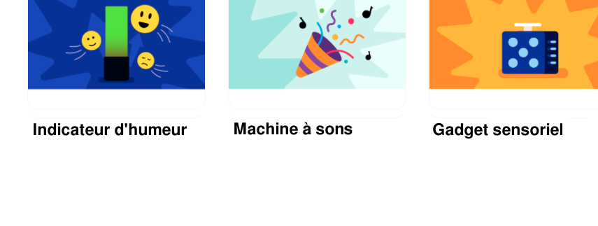

## Partager

Si tu es dans un club, pourquoi ne pas partager ton projet avec des amis ? Tu peux également montrer à ta famille comment fonctionne ton projet.

--- task ---

Inspire la communauté Raspberry Pi Foundation avec ton projet !

Pour soumettre une vidéo de ta machine à sons dans notre galerie [Machine à sons - Communauté](https://wke.lt/w/s/eMsc_S){:target="_blank"}, rempli [ce formulaire](https://form.raspberrypi.org/f/community-project-submissions){:target="_blank"}. N'oublie pas de protéger ton identité en t'assurant qu'aucune personne n'apparaît dans ta vidéo.

--- /task ---
